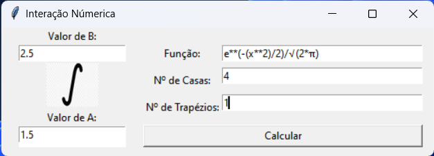

# Métodos Numéricos
## Integração por Método dos Trapézios

Objetivo de demosntrar a compreensão de conceitos teóricos matemáticos aprendidos em sala de aula e implementar numa aplicação intuitiva. A linguagem de desenvolvimento escolhida para tal foi python.

## Exemplo de Uso

### Preencher os respectivos parâmetros de entrada:

- **Função**: e\*\*(-(x*\*2)/2)/√(2\*π)
- **N° de Trapézios**: 1
- **N° de Casas Decimais**: 4
- **Intervalo Inferior**: 1.5
- **Intervalo Superior**: 2.5

